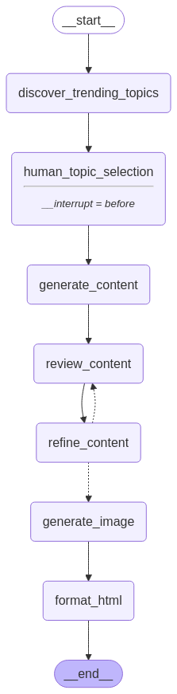

# AI Content Generation Agent

A powerful AI-powered content generation system that automates the creation of high-quality blog posts about trending AI topics. Built with LangGraph and OpenAI, this agent discovers current topics, generates well-structured content with self-critique capabilities, creates relevant images, and publishes polished HTML.



## Features

- **Trending Topic Discovery**: Automatically finds the latest trending topics in AI using web search
- **Human-in-the-loop Selection**: Allows users to select which topic to write about
- **AI Content Generation**: Creates comprehensive, well-structured content on the selected topic
- **Self-Critique and Refinement**: Implements an iterative refinement process to improve quality
- **Image Generation**: Produces relevant visuals using DALL-E
- **Professional HTML Output**: Formats content into a clean, minimalistic blog post

## How It Works

The agent operates through an orchestrated workflow using LangGraph:

1. **Discovery Phase**: The agent searches for trending AI topics and presents them to the user
2. **Selection Phase**: The user selects a topic of interest
3. **Content Generation**: The agent generates initial content based on the selected topic
4. **Refinement Cycle**:
   - Content is reviewed and critiqued
   - Improvements are suggested
   - Content is refined based on feedback
   - This cycle repeats up to the configured maximum iterations
5. **Visual Enhancement**: An appropriate image is generated for the content
6. **Publication**: The final content is formatted into a clean HTML page

## Installation

### Prerequisites

- Python 3.8+
- OpenAI API key
- Tavily API key (for web search)

### Setup

1. Clone the repository:
   ```bash
   git clone https://github.com/yourusername/ContentCreationAgent.git
   cd ContentCreationAgent
   ```

2. Create and activate a virtual environment:
   ```bash
   python -m venv .venv
   source .venv/bin/activate  # On Windows: .venv\Scripts\activate
   ```

3. Install dependencies:
   ```bash
   pip install -r requirements.txt
   ```

4. Create a `.env` file with your API keys:
   ```
   OPENAI_API_KEY=your_openai_api_key
   TAVILY_API_KEY=your_tavily_api_key
   ```

## Usage

Run the agent with:

```bash
python main.py
```

The agent will:
1. Display a list of trending AI topics
2. Prompt you to select one by number
3. Generate, refine, and enhance content (this may take a few minutes)
4. Create an image for the content
5. Generate an HTML file in the `output` directory

## Project Structure

```
ContentCreationAgent/
├── agent/                 # Core agent components
│   ├── config.py          # Configuration settings
│   ├── state.py           # State definition
│   ├── topic_discovery.py # Topic discovery functions
│   ├── content_generation.py  # Content generation and refinement
│   ├── image_generation.py    # Image generation
│   ├── html_formatter.py  # HTML output formatting
│   └── graph_builder.py   # LangGraph workflow builder
├── images/                # Generated images
├── output/                # Output HTML files
├── .env                   # Environment variables
├── main.py                # Entry point
└── README.md              # Documentation
```

## Configuration

You can customize the agent's behavior by modifying settings in `agent/config.py`:

- `LLM_MODEL`: The OpenAI model to use (default: "gpt-4o")
- `MAX_ITERATIONS`: Number of content refinement iterations (default: 1)
- `MAX_SEARCH_RESULTS`: Number of search results to retrieve (default: 5)
